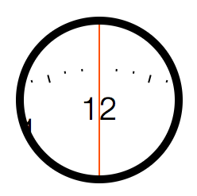
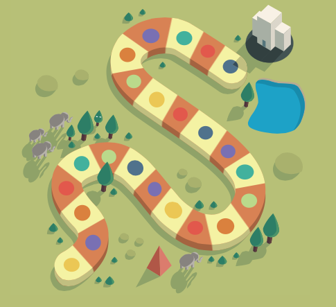
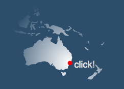
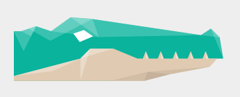
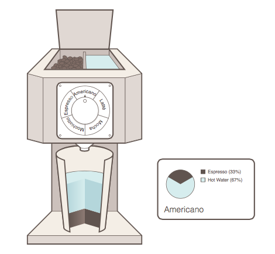

TODO
===

- The Clock demo is working, but its source code can be made a bit more straightforward, at places. 

- Create a 'side by side' comparison like `scalajs-react` has, showing JavaScript code, running it, and Scala.js code, and running it. (initially for the clock sample)

- The rest of the binding is NOT in working condition, yet! The plan is to progress demo by demo, until all Adobe Snap.svg examples are reproduced, then tackle the rest of the (uneffected) API.

### How to contribute:

- Help with the 'side-by-side' infrastructure?

- Take your favourite Snap.svg [demo](https://github.com/adobe-webplatform/Snap.svg/tree/master/demos) and try to convert it to scala.js. You *will* need to fix some APIs in the bridging while doing that.

### Demos that work

- Got clock to work, thanks for the support on the mailing list!!! AK230814

### Demos to do

